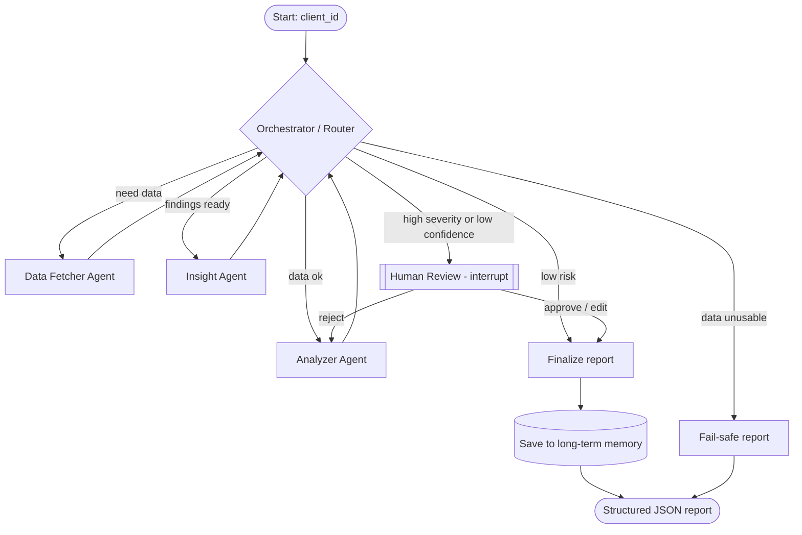

# Planning — Wealth Advisor Assistant (Multi-Agent System)

Assignment: AI Engineer (Agent Systems) technical assessment
Deadline: 24 hours from when the assignment was shared
Working budget: about 14 hours

---

## 1. How to win this assessment

The reviewers score five things. Every decision below serves one of them.

| What they score | How we show it |
|---|---|
| System design and architecture clarity | One clear graph, one diagram, one state object |
| Agent abstraction and modularity | Agents depend on tool interfaces, never on raw code |
| Code quality and maintainability | Types, Pydantic schemas, tests, lint, small files |
| Edge case handling | Bad-data sample clients + failure injection + tests that prove it |
| Thoughtful trade-offs | A written "Decisions and trade-offs" section in the README |

Rule for the whole build: **a small system that runs perfectly beats a big system that breaks.** The reviewer will clone the repo and run one command. That command must work without an API key.

---

## 2. Decisions locked

| Topic | Decision | Reason |
|---|---|---|
| Language | Python 3.11+ | Standard for agent work |
| Orchestration | LangGraph `StateGraph` | Built-in state, checkpoints, human-in-the-loop pause/resume |
| LLM provider | OpenAI, smallest mini/nano tier, set by `OPENAI_MODEL` in `.env` | Low cost; model name is config, not code |
| LLM role | **Hybrid**: numbers and anomalies by deterministic code, LLM only writes the advisory narrative | Cheap, testable, no made-up numbers in a finance product |
| No API key | Automatic fallback to a `MockLLM` (template-based) | Reviewer can run it with zero setup |
| Routing | Rule-based conditional edges (no LLM in the router) | Predictable, free, easy to test |
| Interface | CLI (primary) + Streamlit UI (demo) | CLI for reviewers and tests, UI for the approval screen |
| Storage | SQLite (checkpoints + long-term memory + LLM cache) | Zero infrastructure, one file |
| Validation | Pydantic v2 | Structured inputs and outputs |
| Logging | `structlog`, JSON lines, `run_id` on every line | Debugging and observability |
| Tooling | `uv` or `pip`, `ruff`, `pytest`, Docker, GitHub Actions | Production signal |

> Before coding, open OpenAI's pricing page and put the current cheapest suitable model name into `.env.example`. Model names change often, so never hard-code one.

---

## 3. Full feature list

### 3.1 Required (must be 100% done)

| ID | Feature | Assignment section |
|---|---|---|
| R1 | Ingest client financial data from JSON, validated by schema | Inputs |
| R2 | Mock CRM API (profile, risk tolerance, goals, last contact) | Inputs |
| R3 | Anomaly detection: unusual transactions, trends, risk signals | Inputs |
| R4 | Orchestrator agent: coordinates, routes, manages flow | Core 1 |
| R5 | Data Fetcher agent | Core 2 |
| R6 | Analyzer agent | Core 2 |
| R7 | Tool abstraction: `BaseTool` interface + registry | Core 3 |
| R8 | Error handling: retries, timeouts, fallbacks, partial results | Core 4 |
| R9 | Logging: flow, decisions, errors | Core 5 |
| R10 | Structured output (JSON report) for advisory decisions | Problem statement |
| R11 | README: architecture, flow, trade-offs, assumptions, run steps | Deliverables |
| R12 | Sample input and output committed in the repo | Submission |

### 3.2 Bonus (strongly preferred, so we treat as required)

| ID | Feature |
|---|---|
| B1 | Short-term memory: session context in graph state + checkpointer |
| B2 | Long-term memory: past run summaries and past anomalies per client in SQLite |
| B3 | Human-in-the-loop: advisor approves, edits or rejects before the final report |

### 3.3 Extras (what makes the submission stand out)

| ID | Feature | Why it impresses |
|---|---|---|
| E1 | Third specialist: Insight agent (turns findings into recommendations) | Goes beyond "minimum 2" |
| E2 | Cost control: one LLM call per run, compact prompt, cache, token and cost log | Shows production thinking |
| E3 | Failure injection: `--simulate-crm-failure`, `CRM_FAILURE_RATE` | Reviewer can *see* the error handling work |
| E4 | Evaluation script: precision and recall on labelled mock anomalies | Very few candidates measure quality |
| E5 | Memory-aware analysis: "new" vs "recurring" anomaly; advisor-marked false positives are remembered | Makes memory useful, not decorative |
| E6 | PII masking in logs | Finance domain awareness |
| E7 | Execution trace view in Streamlit (which node ran, how long, what it decided) | Observability made visible |
| E8 | Tests, lint, Dockerfile, Makefile, CI workflow | Maintainability |
| E9 | Data quality report in the output (what was missing, what was assumed) | Honest outputs |
| E10 | "Not financial advice" disclaimer and confidence level on every report | Responsible AI |

---

## 4. Architecture

### 4.1 Flow



Pattern: **supervisor (hub and spoke)**. Every agent returns to the orchestrator, which reads the shared state and picks the next step. The orchestrator also enforces a max-step limit so the graph can never loop forever.

### 4.2 Agents

| Agent | Job | Tools it uses | LLM? |
|---|---|---|---|
| Orchestrator | Reads state, decides next node, logs the reason, enforces step limit | none | No |
| Data Fetcher | Loads client JSON, calls CRM, loads past memory, builds data quality report | `ClientDataTool`, `CrmTool`, `MemoryReadTool` | No |
| Analyzer | Portfolio metrics, anomaly detection, risk signals, severity score | `PortfolioMetricsTool`, `AnomalyDetectionTool` | No |
| Insight | Writes summary and recommended actions from the findings | `LLMTool` (OpenAI or Mock) | Yes, one call |
| Human Review | Pauses the graph and waits for the advisor decision | none (`interrupt`) | No |

### 4.3 Layers (the key modularity idea)

```
Agents  ->  Tool interface (BaseTool, ToolResult)  ->  Services (raw implementations)
```

- An agent receives tools through its constructor (dependency injection).
- An agent never imports `services/`. Only tools do.
- Every tool returns `ToolResult(ok, data, error, source, latency_ms)`. Tools never raise to the agent.
- To swap the mock CRM for a real one, change one file. This sentence goes in the README.

### 4.4 Shared state (one object, typed)

`run_id`, `client_id`, `thread_id`, `client_data`, `crm_profile`, `history`, `data_quality`, `metrics`, `anomalies`, `risk_score`, `insights`, `review_decision`, `errors[]`, `trace[]`, `step_count`, `status`

### 4.5 Anomaly checks (deterministic)

| Type | Check | Method |
|---|---|---|
| Transaction | Unusually large amount | Robust z-score (median and MAD) per category |
| Transaction | Duplicate payment | Same amount + payee within a short window |
| Transaction | Large cash withdrawal or transfer out | Threshold as % of liquid assets |
| Transaction | New or unusual payee/category | Not seen in history |
| Trend | Spending spike | Month vs rolling average |
| Trend | Income drop | Month vs rolling average |
| Trend | Fast portfolio drawdown | % fall from peak |
| Risk | Concentration | Single asset or sector above a limit |
| Risk | Risk profile mismatch | Portfolio risk vs CRM risk tolerance |
| Risk | Low liquidity | Cash below N months of expenses |

Each anomaly has: `id`, `type`, `severity` (low/medium/high), `evidence` (the numbers), `explanation`, `is_recurring`.

---

## 5. Folder structure

```
wealth-advisor-agents/
├── README.md
├── planning.md
├── pyproject.toml
├── .env.example
├── .gitignore
├── Makefile
├── Dockerfile
├── .github/workflows/ci.yml
│
├── data/
│   ├── clients/                 # client_001.json ... (mock inputs)
│   ├── crm/crm_records.json     # mock CRM database
│   └── labels/expected_anomalies.json   # ground truth for evaluation
│
├── samples/
│   ├── sample_input.json
│   ├── sample_output.json
│   └── sample_run.log
│
├── src/wealth_advisor/
│   ├── config.py                # settings from env (pydantic-settings)
│   ├── errors.py                # custom exception types
│   ├── cli.py                   # entry point
│   │
│   ├── schemas/                 # Pydantic models
│   │   ├── client.py
│   │   ├── crm.py
│   │   ├── analysis.py
│   │   └── report.py
│   │
│   ├── graph/                   # orchestration
│   │   ├── state.py
│   │   ├── orchestrator.py      # routing logic
│   │   └── builder.py           # builds and compiles the StateGraph
│   │
│   ├── agents/
│   │   ├── base.py              # BaseAgent: name, tools, run(state)
│   │   ├── data_fetcher.py
│   │   ├── analyzer.py
│   │   ├── insight.py
│   │   └── human_review.py
│   │
│   ├── tools/                   # the abstraction layer
│   │   ├── base.py              # BaseTool, ToolResult
│   │   ├── registry.py
│   │   ├── resilience.py        # retry, timeout, circuit breaker
│   │   ├── client_data.py
│   │   ├── crm.py
│   │   ├── portfolio_metrics.py
│   │   ├── anomaly_detection.py
│   │   └── memory_tools.py
│   │
│   ├── services/                # raw implementations (agents never import this)
│   │   ├── mock_crm.py          # latency + failure simulation
│   │   └── file_store.py
│   │
│   ├── llm/
│   │   ├── base.py              # LLMClient interface
│   │   ├── openai_client.py
│   │   ├── mock_client.py
│   │   ├── prompts.py
│   │   ├── cache.py
│   │   └── cost.py              # token and cost tracking
│   │
│   ├── memory/
│   │   ├── short_term.py        # checkpointer setup
│   │   └── long_term.py         # SQLite store of summaries and anomalies
│   │
│   └── observability/
│       ├── logging.py           # structlog config, PII masking
│       └── trace.py             # per-node timing and decisions
│
├── ui/streamlit_app.py
│
├── scripts/
│   ├── generate_mock_data.py
│   └── evaluate.py
│
└── tests/
    ├── conftest.py
    ├── unit/                    # tools, anomaly checks, router, schemas
    └── integration/             # full graph runs, failure paths, HITL
```

---

## 6. Phases

Each phase ends with something that runs. Commit at the end of every phase with a clear message; the commit history is part of the impression.

### Phase 0 — Setup (0.5 h)
- Repo, `pyproject.toml`, `.gitignore`, `.env.example`, `Makefile`, ruff config, empty package
- **Done when:** `make install` and `pytest` (zero tests) pass

### Phase 1 — Schemas and mock data (1 h) → R1, R2
- Pydantic models: client, accounts, holdings, transactions, CRM profile
- `generate_mock_data.py` with a fixed random seed
- Five sample clients:
  1. Clean client, no anomalies
  2. Client with seeded anomalies (large transfer, duplicate, spike, concentration)
  3. Client with missing and null fields
  4. Client that does not exist in the CRM
  5. Client with empty or malformed transactions
- `expected_anomalies.json` for client 2
- **Done when:** all five files load or fail with a clear validation message

### Phase 2 — Tool layer and mock CRM (1.5 h) → R7, R8, E3
- `BaseTool`, `ToolResult`, `ToolRegistry`
- `mock_crm.py` with random latency and a configurable failure rate
- `resilience.py`: retry with exponential backoff, timeout, simple circuit breaker
- `CrmTool` fallback order: live call → last cached profile → default profile marked `degraded`
- Unit tests for success, retry-then-success, total failure
- **Done when:** tools never raise; every failure comes back as `ToolResult(ok=False)`

### Phase 3 — Agents, graph and CLI: the MVP (2.5 h) → R3, R4, R5, R6, R10
- `BaseAgent`, three agents, state, orchestrator routing, max-step guard
- All ten anomaly checks, severity scoring
- Template-based report (no LLM yet)
- CLI: `python -m wealth_advisor.cli run --client client_002`
- **Done when:** one command prints a valid JSON report for all five clients. **This is the safety point: from here the core assignment is complete.**

### Phase 4 — Logging and hardening (1 h) → R9, E6, E9
- structlog JSON to console and `logs/run.jsonl`, `run_id` on every line
- Log every routing decision with its reason
- Per-node timing in `trace[]`
- PII masking (account numbers, names)
- Global exception handler in each node: error goes into `state.errors`, the run continues or ends cleanly
- **Done when:** a run with `--simulate-crm-failure` finishes with a report marked `degraded` and a readable log

### Phase 5 — LLM insight with cost control (1 h) → E1, E2
- `LLMClient` interface, OpenAI client, Mock client
- One call per run, structured output parsed into a Pydantic model
- Prompt receives a compact summary of findings, never raw transactions
- Output token cap, temperature 0, SQLite cache keyed by a hash of the findings
- Token and estimated cost logged per run
- Guard: every number in the LLM text must exist in the findings, otherwise fall back to the template
- **Done when:** works with a key, works without a key, second identical run costs zero

### Phase 6 — Memory (1 h) → B1, B2, E5
- Short-term: SQLite checkpointer, `thread_id` per session
- Long-term: tables `run_summaries`, `anomaly_history`, `advisor_feedback`
- Fetcher loads history; Analyzer marks anomalies as new or recurring; false positives from past reviews are down-ranked
- **Done when:** running the same client twice changes the second report ("recurring", "compared to last review")

### Phase 7 — Human-in-the-loop (1 h) → B3
- `interrupt()` in the review node when severity is high or data is degraded
- Decisions: approve, edit recommendations, reject and re-analyze, mark anomaly as false positive
- CLI prompt; `--auto-approve` flag for tests and CI
- Decision and reviewer note saved to long-term memory and to the report (`reviewed_by`, `review_decision`)
- **Done when:** the run pauses, survives a process restart, and resumes from the checkpoint

### Phase 8 — Streamlit UI (1.5 h) → E7
- Pick client → run → see metrics, anomaly table, insights
- Approval screen with approve, edit, reject buttons
- Trace timeline tab and past-runs (memory) tab
- Toggle for CRM failure simulation
- **Done when:** the full flow including approval works from the browser

### Phase 9 — Tests and evaluation (1.5 h) → E4, E8
- Unit: each anomaly check, router decisions, tool fallbacks, schema validation
- Integration: happy path, CRM down, client not found, empty transactions, HITL approve and reject, LLM failure
- `evaluate.py`: precision and recall against `expected_anomalies.json`
- **Done when:** `make test` is green and the evaluation prints a small table

### Phase 10 — Docs and delivery (1.5 h) → R11, R12
- README (outline in section 9)
- Commit `samples/` input, output and log
- Dockerfile, CI workflow (lint + tests)
- **Final check:** fresh clone in a new folder, follow the README word by word, with no API key
- **Done when:** a stranger can run it in under five minutes

**Total: 14 hours**

### If time runs short, cut in this order
1. CI workflow and Dockerfile
2. Streamlit trace and memory tabs (keep the approval screen)
3. Circuit breaker (keep retry and fallback)
4. Evaluation script

Never cut: Phase 3 MVP, logging, error handling, README, sample output.

---

## 7. Edge cases to handle and test

| Case | Expected behaviour |
|---|---|
| Client file not found | Clean error report, exit code non-zero, no stack trace |
| Invalid JSON or schema error | Validation message listing the bad fields |
| Missing optional fields | Continue, list them in the data quality report |
| Empty transaction list | Skip transaction checks, still run portfolio checks, say so in the report |
| Too little history for statistics | Use threshold rules instead of z-scores, lower the confidence |
| CRM timeout or 500 | Retry, then cache, then default profile; report marked `degraded` |
| Client not in CRM | Continue without profile; skip risk-mismatch check |
| Negative or zero amounts, future dates, duplicate IDs | Flag as data quality issue, exclude from statistics |
| Mixed currencies | Assumption: single base currency; flag if others appear |
| LLM error, timeout or bad JSON | One retry, then template fallback |
| No API key | Mock LLM, noted in the report |
| Router loop | Max-step guard ends the run with a clear error |
| Reviewer rejects twice | Stop and return the report marked `needs_manual_review` |

---

## 8. Cost optimization plan

1. LLM is used in one agent only, one call per run.
2. All math and detection is done in Python, so the prompt is small.
3. Prompt carries a compact findings summary (top anomalies, key metrics), not raw data.
4. Hard cap on output tokens; temperature 0.
5. Cache by hash of findings: same data, zero cost.
6. Smallest suitable OpenAI model, set in config.
7. Token count and estimated cost written to the log and the report metadata.
8. Mock LLM for tests and CI, so the test suite costs nothing.

Expected cost per client run: a fraction of a cent.

---

## 9. README outline

1. What it is (three lines) and a screenshot of the UI
2. Quick start: three commands, works without an API key
3. Architecture diagram (the mermaid flow above)
4. Agents and their responsibilities
5. Agent interaction walkthrough of one real run, with log lines
6. Tool abstraction: how to add a new tool or swap the CRM
7. Error handling and fallback table
8. Memory design (short-term and long-term)
9. Human-in-the-loop: when it triggers, what the advisor can do
10. Logging and observability
11. Key decisions and trade-offs
    - LangGraph vs custom orchestrator
    - Deterministic detection vs LLM detection
    - Rule-based router vs LLM router
    - SQLite vs vector database for memory
    - In-process mock CRM vs separate mock server
    - Statistical rules vs ML models (Isolation Forest) for anomalies
12. Assumptions
13. Sample input and output
14. Testing and evaluation results
15. What I would do next for real production (async, Postgres, auth, real CRM, tracing, queue, model-based detection)

---

## 10. Submission checklist

- [ ] Fresh clone runs with README steps only
- [ ] Runs without an OpenAI key
- [ ] No secrets in the repo; `.env` is git-ignored
- [ ] `samples/` has input, output and a log
- [ ] All tests green
- [ ] README has diagram, trade-offs, assumptions
- [ ] Clean commit history, one commit per phase
- [ ] Repo is public or shared with the reviewer
- [ ] Submitted before the deadline, with a short message listing what was built and the bonus items

---

## 11. Be ready to explain in the interview

- Why hub-and-spoke instead of a linear pipeline
- Why the LLM does not detect anomalies
- What happens, step by step, when the CRM is down
- How you would replace SQLite memory with a vector store
- How the system would scale to thousands of clients
